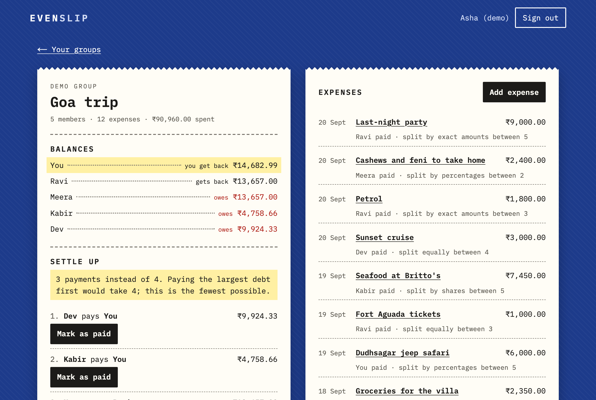
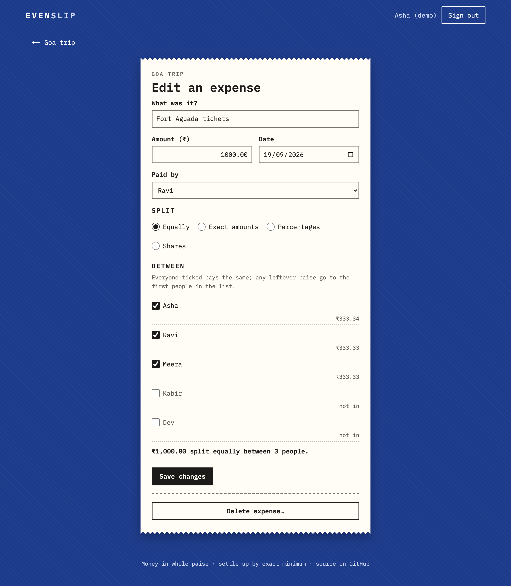
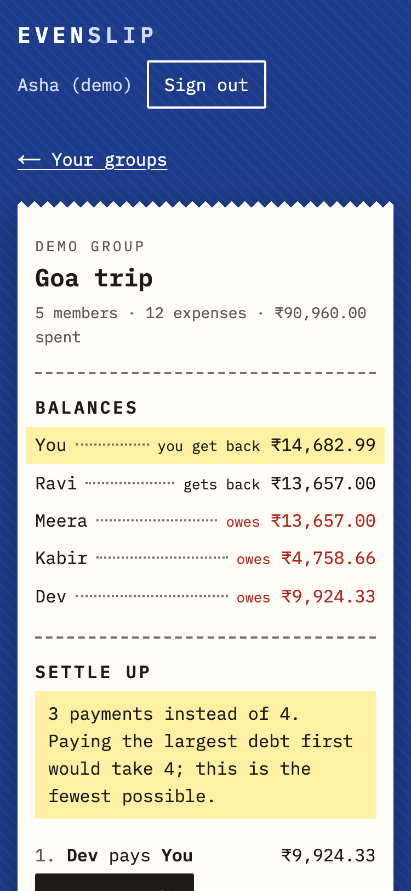
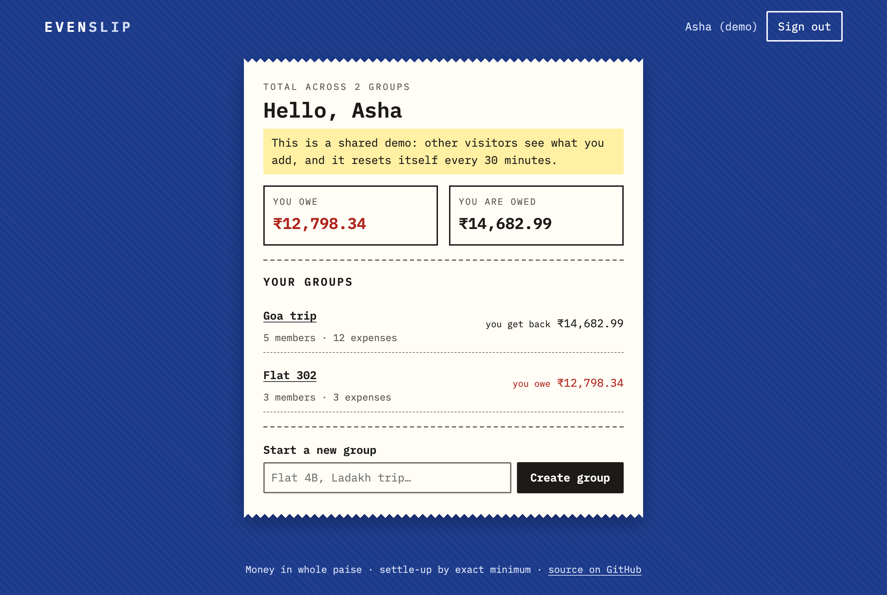

# Evenslip

[](https://github.com/Seshasai-Tunuguntla/evenslip/actions/workflows/ci.yml)

Split the bill with a group (a trip, a shared flat), see who owes whom, and settle up in the
**fewest possible payments**. Built with Next.js Server Components and Server Actions, Postgres and
Drizzle, in strict TypeScript, with money handled as whole paise from end to end.

**Live: <https://evenslip.vercel.app>** (no sign-up needed: press "Try the demo")

| The group's receipt | Adding an expense |
|---|---|
|  |  |

<p>
  
  
</p>

## The demo story

"Try the demo" signs you in as **Asha**, back from a Goa trip with Ravi, Meera, Kabir and Dev:
12 expenses (flights split equally, the villa by shares because couples took the big rooms, scooters
by exact amounts, a jeep safari by percentages...). The settle-up panel says **"3 payments instead of
4"**: the obvious method needs four. Mark one as paid and watch the balances move, or add an expense
and see the split previewed to the paisa. Asha also shares a flat, so the dashboard shows what she
owes in one group and is owed in the other.

The demo is shared by every visitor, so it **rebuilds itself** when it's 30+ minutes old (on a cold
start and on each demo sign-in). Demo groups can't send invites, and the demo account can't join real
groups.

## Features

- Sign in with **GitHub**, or one-click **demo**.
- **Groups** with **invite links** (a random 256-bit token; only its SHA-256 is stored, the link is
  shown once, expires after 7 days, and a new one revokes the old).
- **Placeholder members** (a name, no account), whom someone joining by link can claim.
- **Expenses**: who paid, the amount, and a split **equally, by exact amounts, by percentages or by
  shares**. Edit and delete with **conflict detection**.
- **Balances**, **settle-up suggestions** and **Mark as paid** (with Undo).
- **Dashboard**: what you owe and are owed across all your groups.

## The settle-up algorithm

Each member's balance is what they paid minus their shares (plus payments made, minus payments
received); balances always add up to zero. Two algorithms turn balances into payments:

- **Greedy**: the largest debtor pays the largest creditor as much as they can; repeat. Fast and at
  most n − 1 payments, but not always the fewest.
- **Exact minimum**: any settlement links people into connected groups, each of which must add up to
  zero, and a zero-sum group of k people needs at least k − 1 payments. So **the fewest payments is
  n − (the largest number of disjoint zero-sum subgroups)**. A DP over subsets finds that number:
  `best[mask] = max over i in mask of best[mask without i] + (sum[mask] == 0 ? 1 : 0)`, O(2ⁿ·n).
  Walking back along an optimal path splits the people into those subgroups, and greedy settles each
  one in exactly k − 1 payments. It's exact up to **15 people with a non-zero balance** (about half a
  million steps); above that the app falls back to greedy and says so.

**Worked example** (the demo). Balances: Asha +14,682.99, Ravi +13,657.00, Meera −13,657.00,
Kabir −4,758.66, Dev −9,924.33.

| Greedy: 4 payments | Exact: 3 payments |
|---|---|
| Meera → Asha ₹13,657.00 (largest debt to largest credit)<br>Dev → Ravi ₹9,924.33<br>Kabir → Ravi ₹3,732.67<br>Kabir → Asha ₹1,025.99 | {Ravi, Meera} and {Asha, Kabir, Dev} each add up to zero, so 5 − 2 = 3:<br>Meera → Ravi ₹13,657.00<br>Dev → Asha ₹9,924.33<br>Kabir → Asha ₹4,758.66 |

**Splits assign every paisa.** Each person gets the floor of their exact share; the leftover paise go
one each to the largest fractional parts, ties to whoever joined the group first. ₹100 split three
ways is **3334 + 3333 + 3333** paise. The computation uses BigInt, and amounts are parsed from text
digit by digit: no floating-point number ever holds money.

## Architecture

```
Browser ──► Server Components (src/app)        read: requireMember() → loadLedger()
        ──► Server Actions (src/server/actions.ts)
              requireUser() / requireMember()  signed out → redirect; not a member → 404
              Zod parses the form → src/lib does the maths → one Drizzle transaction
src/lib     money, split, settle, balances: pure functions, also used in the browser for the live
            split preview, so the preview and the saved split can't disagree
Postgres    Neon (pooled connection for the app, direct one for migrations), Drizzle + node-postgres
Auth.js     JWT session cookie holding only our user id; GitHub, or the demo credentials provider
```

- **Authorization on the server, every time.** Every Server Action and page starts with the session
  check and the membership check; ids from the browser (including `.bind` arguments) are untrusted
  and must be UUIDs. A non-member gets the same 404 whether or not the group exists.
- **Optimistic locking.** Expenses have a `version`; a save or delete must name the version it started
  from (`UPDATE … WHERE version = $n`). A stale save writes nothing and says "Someone else saved this
  expense after you opened it" with a link to reload; tested, including two saves at the same moment.
- **Mark as paid** records a payment only while it's still one of the current suggestions, with the
  group row locked, so a double click or a second tab can't record it twice.
- **Database CHECK constraints**: amounts positive (shares ≥ 0, since ₹0.02 three ways is 1 + 1 + 0),
  no payments to yourself, the split type, name lengths.
- **Demo reset**: the last rebuild time lives in the database; the rebuild runs inside a transaction
  holding `pg_advisory_xact_lock`, so concurrent cold starts and sign-ins run exactly one rebuild.
- **Previews never touch production data**: the database settings exist for Production only, and the
  app refuses to connect from a preview unless `PREVIEW_HAS_OWN_DATABASE=true`. Migrations run in the
  production build (`scripts/vercelBuild.ts`).

## Trade-offs

- **One shared demo account.** Visitors see each other's changes until the next rebuild. Separate demo
  copies per visitor would need cleanup jobs; a 30-minute reset keeps it simple.
- **JWT sessions** can't be revoked server-side before they expire, but every request re-reads the user
  and membership, so a removed user or member loses access immediately.
- **Balances are recomputed from all expenses** on each page load. Fine for group-sized data; large
  groups would want a stored running balance.
- **Mark as paid only for suggested payments**, not arbitrary amounts. It keeps the ledger consistent
  with the suggestions and makes duplicates detectable.
- **No member removal or renaming yet**, one currency (₹), and suggested payments can include paise
  (₹9,924.33) because that's what the shares add up to.

## Testing

- **Vitest unit tests** for the maths: a fixed example where exact beats greedy (3 vs 4); fast-check
  properties (everyone ends at zero, no self-payments, positive whole-paise payments, exact ≤ greedy,
  deterministic); a brute-force exhaustive search as a reference for tiny groups; splits (remainders,
  all four types, invalid input, every paisa assigned and within one paisa of the exact share).
- **Integration tests against real Postgres**: every Server Action called signed out (redirect, nothing
  changes) and as a non-member (404, nothing changes); the edit conflict; concurrent saves and
  Mark-as-paid; the CHECK constraints; invites (only the hash stored, claiming a placeholder); the demo
  data, the 30-minute rule and the single rebuild under concurrency.
- **Playwright** on the production build at 1280px and 375px: try the demo → settle-up shows 3 instead
  of 4 → mark as paid → add an expense split three ways (33.34 + 33.33 + 33.33), with **axe** (WCAG
  2.2 A/AA rules) on every screen and a check that nothing scrolls sideways. `npm run e2e:live` runs a
  read-only version against the live site.

CI runs typecheck, lint (oxlint), the contrast check (every colour pair in `src/app/tokens.css` meets
WCAG AA), tests, build and the end-to-end test; a pre-push hook runs the same checks locally.

## Running it locally

You need Node 24 and PostgreSQL.

```bash
npm install
createdb evenslip_dev && createdb evenslip_test && createdb evenslip_e2e
cp .env.example .env.local   # then set AUTH_SECRET (openssl rand -base64 32)
DATABASE_URL=postgresql://localhost:5432/evenslip_dev npm run db:migrate
npm run dev                  # http://localhost:3000, "Try the demo"
```

`npm run check` runs typecheck, lint, contrast, tests and build (tests use `evenslip_test`, or
`TEST_DATABASE_URL`; the setup refuses any database whose name doesn't end in `_test`).
`npm run e2e` builds and runs the end-to-end test on `evenslip_e2e` (needs `npx playwright install
chromium`). After changing `src/server/schema.ts`, `npm run db:generate` writes a migration.

GitHub sign-in needs an OAuth app (callback `http://localhost:3000/api/auth/callback/github`) in
`AUTH_GITHUB_ID` / `AUTH_GITHUB_SECRET`; without it the button is hidden and the demo still works.

**Deploying:** one Vercel project (`vercel.json`), Neon from the Vercel Marketplace connected to
Production only, `AUTH_SECRET` and the GitHub OAuth app's id and secret as Production environment
variables. `npm run screenshots` retakes the README pictures and the link-preview image from the live
site.
